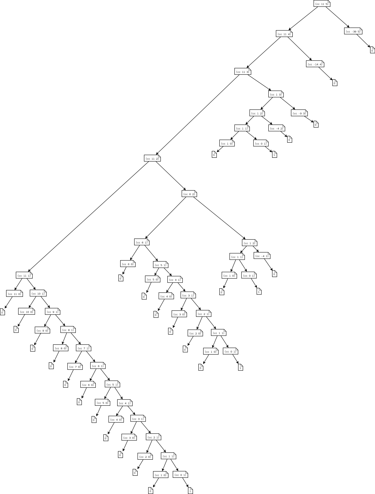

### 1.2过程及其产生的计算

#### exercise1.9

两种定义下的计算序列分别如下所示：

```bash
(+ 4 5)
(inc (+ 3 5))
(inc (inc (+ 2 5)))
(inc (inc (inc (+ 1 5))))
(inc (inc (inc (inc (+ 0 5)))))
(inc (inc (inc (inc 5))))
(inc (inc (inc 6)))
(inc (inc 7))
(inc 8)
9


(+ 4 5)
(+ 3 6)
(+ 2 7)
(+ 1 8)
(+ 0 9)
9
```


#### exercise1.10

```bash
(A 1 10):
x = 1, y = 10 计算(A (- 1 1) (A 1 (- 10 1))), 即 (A 0 (A 1 9)) = 2 * (A 1 9)
x = 1, y = 9 计算(A 0 (A 1 8)) = 2 * (A 1 8)
...
依次类推有：
(A 1 10) = 2 * (A 1 9) = 4 * (A 1 8) =...= 512 * (A 1 1) = 1024


(A 2 4):
(A 2 4) = (A 1 (A 2 3))
根据(A 1 10)的计算过程可以知道：(A 1 (A 2 3)) = 2 ^ (A 2 3)
(A 2 3) = 2 ^ (A 2 2)
(A 2 2) = 2 ^ (A 2 1) = 2 ^ 2 = 4
(A 2 3) = 2 ^ 4 = 16
(A 2 4) = 2 ^ 16 = 65536

(A 3 3)：
(A 3 3) = (A 2 (A 3 2)) = 2 ^ (2 ^ (... ^ 2)..) (共(A 3 2) - 1个乘幂)
(A 3 2) = (A 2 (A 3 1)) = 2 ^ (2 ^ (... ^ 2)..) (共(A 3 1) - 1个乘幂)
(A 3 1) = 2
(A 3 2) = 2 ^ 2 = 4 (一次乘幂)
(A 3 3) = 2 ^ (2 ^ (2 ^ 2)) = 65536 (三次乘幂)
```

```bash
根据上面的计算过程，不难推算出递推公式：
(f n) = (A 0 n) = 2n
(g n) = (A 1 n) = (A 0 (A 1 n-1)) = 2 * (A 1 n-1) = 2(g n-1)=2^2(g n-2)=...=2^n
(h n) = (A 2 n) = (A 1 (A 2 n-1)) = 2 ^ (A 2 n-1) = 2 ^ (h n-1) 
	  										  = 2 ^ (2 ^ (h n-2))
	  										  = 2 ^ (2 ^ (2 ^ (h n-3)))
	  										  ...
	  										  = 2 ^ (2 ^ (2 ^ (2 ^ ...))...)
	  										  (共n-1次求幂)
因此(h n)的结果是n-1次连续求幂
```

#### exercise1.11

递归计算的：

```scheme
(define (f n)
  (cond ((< n 3) n)
        (else (+ (f (- n 1))
                 (* 2 (f (- n 2)))
                 (* 3 (f (- n 3)))
              )
        )
  ))
```

迭代计算过程:

```scheme
(define (f-iter a b c count)
  (if (= count 1)
      c
      (f-iter (+ a
                 (* 2 b)
                 (* 3 c)
              ) a b (- count 1))

(define (f n)
  (f-iter 3 2 1 n))
```

#### exercise1.12

下列过程用于计算帕斯卡三角形第 i 行第 j 列的值

```scheme
(define (pascal-single-value i j)
  (if (or (= i j) (= j 1))
      1
      (+ (pascal-single-value (- i 1) (- j 1)) 
         (pascal-single-value (- i 1) (j))
      )
  ))
```

#### exercise1.13

Fibonaci数列的通项公式为:
$$
\mathrm{Fib}(n)=\cfrac{1}{\sqrt{5}}[(\cfrac{1+\sqrt{5}}{2})^n-(\cfrac{1-\sqrt{5}}{2})^n]
$$
根据Fibonaci数列的定义可知Fib(n)均为正整数。Fib(n)的值等于$(\phi^n-\gamma^n)/\sqrt{5}$,其中$\phi=\cfrac{1+\sqrt{5}}{2},\gamma=\cfrac{1-\sqrt{5}}{2}$ 。显然$\gamma < 1 且|\cfrac{\gamma^n}{\sqrt{5}}| < \cfrac{1}{2}$, 因此结论成立

#### exercise1.14

由于这个图实在是过于复杂，这里直接引用了网上的一幅图，地址是：``https://sicp.readthedocs.io/en/latest/_images/14.png``。结果如下：



##### 空间复杂度：

从上图不难看出来，整个计算过程需要的空间大小就是从根节点到叶子节点的最长路径。这条路径就是最左侧的这条路径: 将硬币种类数减少到1，然后将兑换的硬币数依次减一。因为上述过程每次都仅仅对硬币总数减一，所以减少速度是最慢的。

对于m种硬币数，n美分价值的硬币，其消耗的空间为：$\Theta(m+n)$，这里 $m$ 为常数，因此是线性增长。

##### 时间复杂度：

#### exercise1.15

a) 因为$12.15 / 3^5=12.15/243=0.05<0.1$, 所以要使用5次

b) 该程序会不断递归，直到参数$a<0.1$为止。因此递归的深度 $n$ 就是最小的值使得 $a/3^n<0.1$成立，该值显然为$\Theta(\log a)$。从而计算过程的时间是$\Theta(\log a)$。又由于该过程是一个递归计算过程，所以空间消耗等于递归深度，等于计算的步数，也是$\Theta(\log a)$。